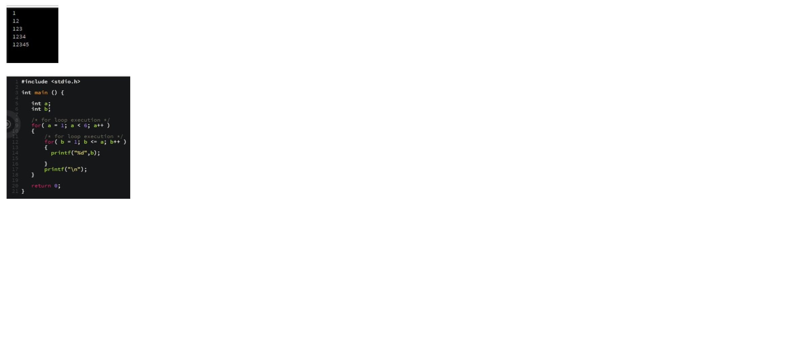

###### Shadi Bdair
# Welcome to C interview

### Question 1:
* How will you print “Hello World” without semicolon?
    ```
    #include <stdio.h> 
    int main(void) 
    { 
        if (printf("Hello World")) { 
        } 
    } 
    ```
---
### Question 2:
* When should we use pointers in a C program?
    * 1. To get address of a variable
    * 2. For achieving pass by reference in C: Pointers allow different functions to share and modify their local variables.
    * 3. To pass large structures so that complete copy of the structure can be avoided.
    * 4. To implement “linked” data structures like linked lists and binary trees.
---
### Question 3:
* What is NULL pointer?
    * NULL is used to indicate that the pointer doesn’t point to a valid location. Ideally, we should initialize pointers as NULL if we don’t know their value at the time of declaration. Also, we should make a pointer NULL when memory pointed by it is deallocated in the middle of a program
---
### Question 4:
* What is difference between i++ and ++i?
    * 1) The expression ‘i++’ returns the old value and then increments i. The expression ++i increments the value and returns new value.
    * 2) Precedence of postfix ++ is higher than that of prefix ++.
    * 3) Associativity of postfix ++ is left to right and associativity of prefix ++ is right to left.
    * 4) In C++, ++i can be used as l-value, but i++ cannot be. In C, they both cannot be used as l-value.
    See Difference between ++*p, *p++ and *++p for more details.
---
### Question 5:
* What is a pointer on pointer?
    * It’s a pointer variable which can hold the address of another pointer variable. It de-refers twice to point to the data held by the designated pointer variable.
---
### Question 6:
* What are the key features in C programming language?
    * Portability – Platform independent language.
    * Modularity – Possibility to break down large programs into small modules.
    * Flexibility – The possibility to a programmer to control the language.
    * Speed – C comes with support for system programming and hence it is compiling and executes with high speed when comparing with other high-level languages.
    * Extensibility – Possibility to add new features by the programmer.
---
### Question 7:
* What are the basic data types associated with C?
    * Int – Represent number (integer)
    * Float – Number with a fraction part.
    * Double – Double-precision floating point value
    * Char – Single character
    * Void – Special purpose type without any value.
---
### Question 8:
*   What is the description for syntax errors?

    * The mistakes when creating a program called syntax errors. Misspelled commands or incorrect case commands, an incorrect number of parameters when called a method /function, data type mismatches can identify as common examples for syntax errors.
---
### Question 8:
*    What are reserved words with a programming language?

        *   The words that are part of the slandered C language library are called reserved words. Those reserved words have special meaning and it is not possible to use them for any activity other than its intended functionality.

    Example: void, return, int.
---
### Question 9:
* What is the difference between ++a and a++?
    * ‘++a”  is called prefixed increment and the increment will happen first on a variable. ‘a++’ is called postfix increment and the increment happens after the value of a variable used for the operations.
---
### Question 10:
* What is the correct code to have following output in C using nested for loop?
 
 ---
###### Shadi Bdair
